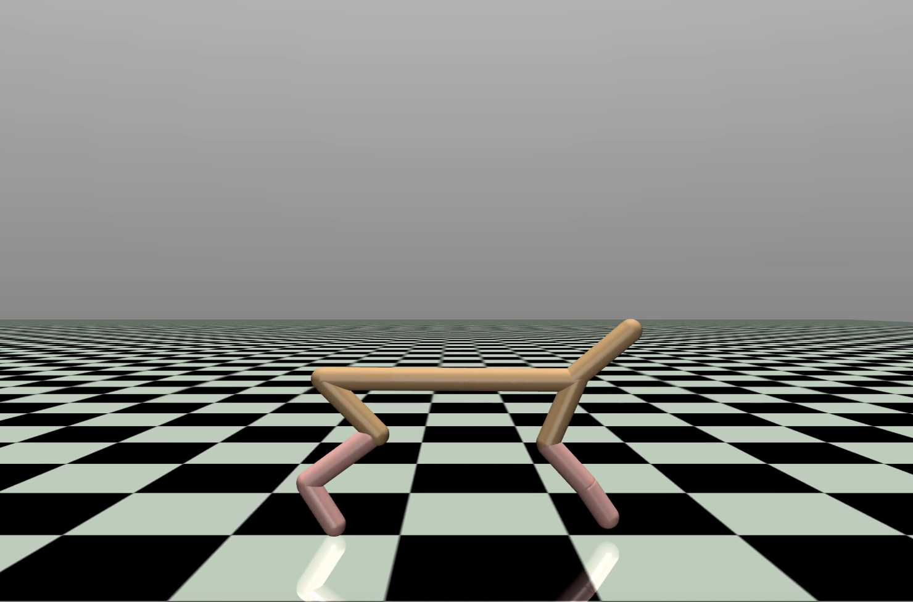

# Cheetah PPO



A minimalist PyTorch implementation of Proximal Policy Optimization (PPO) for the HalfCheetah-v5 MuJoCo environment using Gymnasium.

## Dependencies
- Python 3.8+
- [gymnasium](https://gymnasium.farama.org/) (with MuJoCo support)
- [torch](https://pytorch.org/)
- matplotlib (for plotting)

Install dependencies:
```bash
pip install gymnasium[mujoco] torch matplotlib
```

## Quick Start
1. Clone the repo:
   ```bash
   git clone https://github.com/sam-salehi/cheetah_ppo.git
   cd cheetah_ppo
   ```
2. Train or test the agent:
   ```bash
   python cheetah.py
   ```


